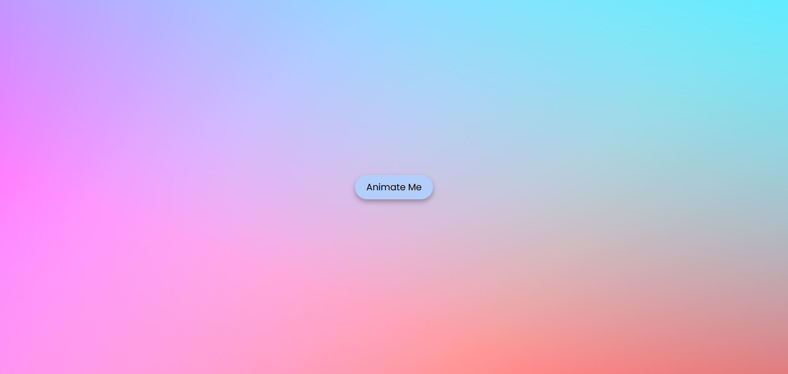

# Button Animation Project
<a href="https://www.linkedin.com/in/dharmendraverma95/" target="_blank">LinkedIn Profile </a>

<a href="https://www.behance.net/dhirukumar" target="_blank">Behance Profile </a>

This is a simple, interactive button animation project created using HTML, CSS, and JavaScript. The goal of this project is to demonstrate various CSS animation techniques that enhance user interaction by animating buttons with different effects.

### Features
<ul>
  <li>tton animation effects (e.g., hover, click, focus).</li>
  <li>Smooth transitions and animations using pure CSS</li>
  <li>Customizable animation durations, colors, and effects.</li>
  <li>Responsive design for seamless use on both desktop and mobile devices.</li>
</ul>

# Preview

 

###### Lang
<ul>
  <li>HTML5</li>
  <li>CSS3</li>
  <li>JavaScript</li>

</ul>

